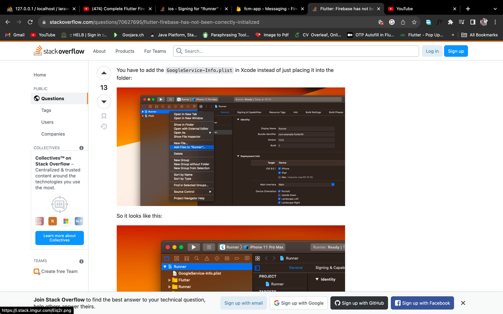

# fcm

FCM notifications

## Getting Started
 - Doc : https://www.dbestech.com/tutorials/flutter-firebase-ios-push-notification
 - Youtube: https://www.youtube.com/watch?v=u-7ut-phOrA&ab_channel=dbestech


## ERROR
 - https://stackoverflow.com/questions/70627695/flutter-firebase-has-not-been-correctly-initialized

## NB
 - Apple id account must be business and personal 
 - Add ios app to Firebase
 - Add the GoogleService-Info.plist file via the Xcode i.e. Right click Runner > Add files to runner
 - 
 - Make sure to update the packages... First delete the .symlinks, pods, Podfile.lock then run:
```
flutter clean
flutter pub get
cd ios
flutter pod install
```
 - 